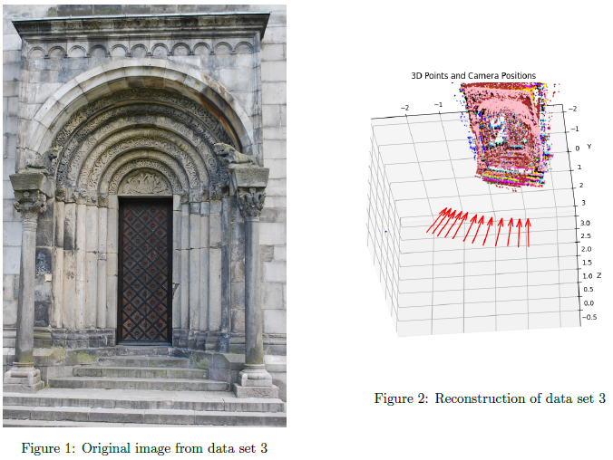

# Structure from motion algorithm
This projects constitutes of a 3D reconstruction software using structure from motion. Where given a dataset will output a 3D reconstruction in the form of a point cloud, see Figure 1 and 2.

