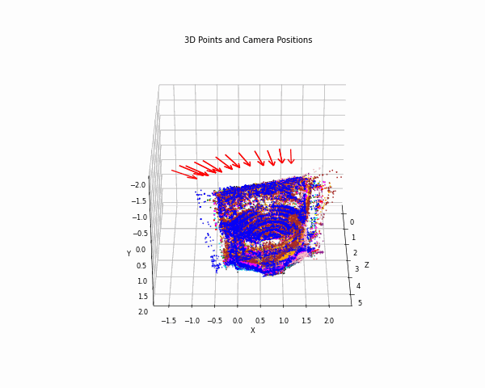
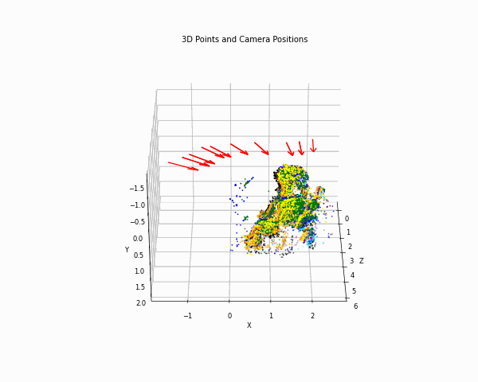

<div style="text-align: center;">
<h1> Structure from motion algorithm</h1>
</div>

This project is a 3D reconstruction software that utilizes structure from motion (SfM) to generate accurate 3D models. Given a dataset of 2D images, the software reconstructs a 3D scene in the form of a point cloud, while also determining the camera positions used during the image capture. The final output includes a detailed 3D point cloud representing the structure and the spatial configuration of the cameras, see animation.

<div style="text-align: center;">
  
</div>

## Installation
Create a conda virtual environment and activate it using the following shell script:

```bash
./build_conda.sh
```

If prefer to directly get the dependencies:
```bash
pip install -r requirements.txt
```

## Implementation

1. First, we calculate the relative orientations between consecutive images using a parallel RANSAC method that combines the estimation of the essential matrix ($E$) and homography ($H$). For non-planar scenes, the essential matrix is calculated using the 7/8-point method to account for depth and camera motion. In planar scenes, the homography is used to describe the transformation between views, as it is more suited for flat surfaces.

2. At each iteration of the RANSAC process, both $E$ and $H$ are estimated, and the model with the highest inlier count is selected. For homography-based estimations, rotation ($R$) and translation ($T$) are derived, and the corresponding essential matrices are computed. A cheirality check ensures that the calculated points are in front of both cameras. This iterative process continues until the optimal camera pose and scene structure are determined based on inlier thresholds for both $E$ and $H$.

3. Upon obtaining the relative rotation vectors, we proceed to compute the absolute rotations. This is
initiated by setting the first rotation vector as the Identity matrix. Subsequently, each successive absolute
rotation is determined by computing the dot product of the preceding absolute rotation and the current
relative rotation. These computed absolute rotations effectively describe the orientation of each camera
in relation to the global coordinate system.

4. Next, we begin by selecting an initial pair of images, which are typically not consecutive; for instance, we
might pair image 1 with image 4. With this initial pair, we aim to construct a preliminary 3D model.
This involves calculating the relative rotation between the selected image pair by executing the RANSAC
process. Utilizing the estimated rotation matrix ($R$), we then perform triangulation to derive the 3D
points.

5. Subsequently, these 3D points are repositioned to the world coordinate system. This is achieved by
taking the dot product of the 3D points with the transposed global rotation matrix of the first image in
the initial pair. Additionally, we preserve the SIFT descriptors for one of the images in this initial pair,
which aids in further processing and analysis.

6. Thereafter, we robustly estimate the translation vector ($T$) for each image by employing a variation of
the RANSAC algorithm. This process involves iterating (approximately 100,000 times) and estimating
$T$ using a two-point method. During each iteration, we calculate $T$ and evaluate the number of inliers
it produces. The T that yields the highest number of inliers is ultimately selected as the most accurate
estimate.

7. Following the estimation of the translation vector ($T$) for each image (camera), we apply the Levenberg-
Marquardt (LM) algorithm to refine each $T$. The LM algorithm focuses on minimizing the reprojection
error. We calculate this error for each $T$, and if the squared sum of these errors is lower than the previously
recorded lowest sum of all squared errors, then we update $T$ with this new value. This iterative refinement
process aims to achieve the most accurate alignment and positioning of the camera in relation to the scene.

8. In the final step, we construct the projection matrix ($P$) for each image by concatenating the absolute
rotation specific to that image with its refined translation vector ($T$), as obtained from the Levenberg-
Marquardt (LM) algorithm. This assembled $P$ matrix is then utilized in the triangulation process for the
reconstruction of 3D points. These reconstructed 3D points, generated from all the images (cameras),
are then visualized along with the camera vectors, providing a comprehensive representation of the scene
as captured from multiple perspectives.

## SFM-Pipeline

#### In order to run the SFM-pipeline, run the following command:

```bash
python3 run_sfm.py --data_path <path_to_dataset> --dataset <name_of_dataset> --threshold <threshold_value> --verbosity <verbosity_option>
```

#### Example:

```bash
python3 run_sfm.py --data_path data --dataset 5 --threshold 1.0 --verbosity INFO  
```

## Visualization

#### To visualize the result of the SFM-pipeline, run:

```bash
python3 visualization.py --dataset <name_of_dataset>
```

The 3D-reconstruction animation is saved to "/output/rotation_dataset_<name_of_dataset>.gif"

<div style="text-align: center;">
  
</div>


## Reconstruct your own scene!
