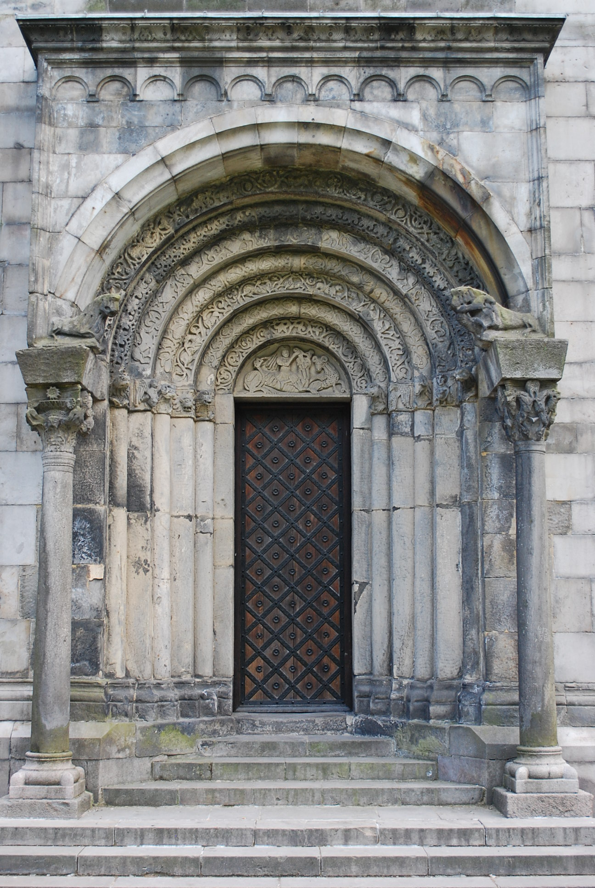
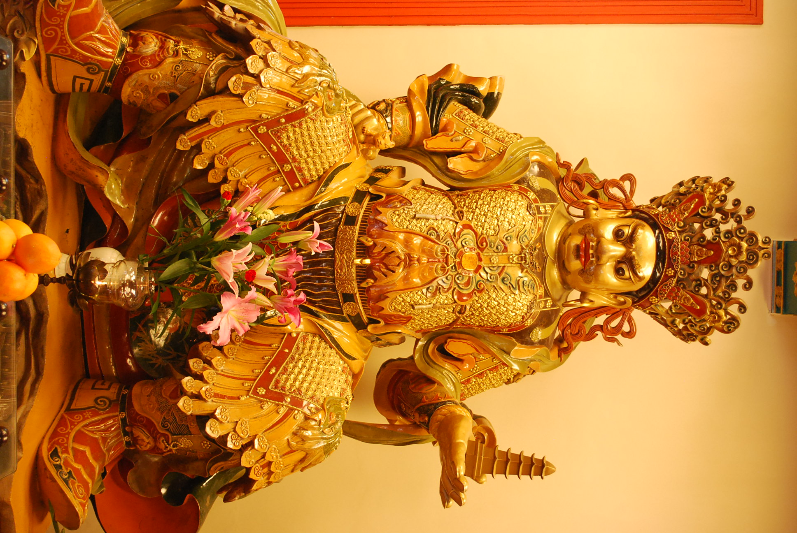

<div style="text-align: center;">
<h1> Structure from motion algorithm</h1>
</div>

This project is a 3D reconstruction software that utilizes structure from motion (SfM) to generate accurate 3D models. Given a dataset of 2D images, the software reconstructs a 3D scene in the form of a point cloud, while also determining the camera positions used during the image capture. The final output includes a detailed 3D point cloud representing the structure and the spatial configuration of the cameras, see animation.

<div style="text-align: center;">
 
</div>

## Installation
Start by cloning the repo:

```bash
git clone https://github.com/MaximilianSalen/Structure-from-Motion.git
```

Create a conda virtual environment and activate it using the following shell script:

```bash
./build_conda.sh
```

If prefer to directly get the dependencies:
```bash
pip install -r requirements.txt
```

## Implementation

1. First, we calculate the relative orientations between consecutive images using a parallel RANSAC method that combines the estimation of the essential matrix ($E$) and homography ($H$). For non-planar scenes, the essential matrix is calculated using the 7/8-point method to account for depth and camera motion. In planar scenes, the homography is used to describe the transformation between views, as it is more suited for flat surfaces.

2. At each iteration of the RANSAC process, both $E$ and $H$ are estimated, and the model with the highest inlier count is selected. For homography-based estimations, rotation ($R$) and translation ($T$) are derived, and the corresponding essential matrices are computed. A cheirality check ensures that the calculated points are in front of both cameras. This iterative process continues until the optimal camera pose and scene structure are determined based on inlier thresholds for both $E$ and $H$.

3. Upon obtaining the relative rotation vectors, we proceed to compute the absolute rotations. This is
initiated by setting the first rotation vector as the Identity matrix. Subsequently, each successive absolute
rotation is determined by computing the dot product of the preceding absolute rotation and the current
relative rotation. These computed absolute rotations effectively describe the orientation of each camera
in relation to the global coordinate system.

4. Next, we begin by selecting an initial pair of images, which are typically not consecutive; for instance, we
might pair image 1 with image 4. With this initial pair, we aim to construct a preliminary 3D model.
This involves calculating the relative rotation between the selected image pair by executing the RANSAC
process. Utilizing the estimated rotation matrix ($R$), we then perform triangulation to derive the 3D
points.

5. Subsequently, these 3D points are repositioned to the world coordinate system. This is achieved by
taking the dot product of the 3D points with the transposed global rotation matrix of the first image in
the initial pair. Additionally, we preserve the SIFT descriptors for one of the images in this initial pair,
which aids in further processing and analysis.

6. Thereafter, we robustly estimate the translation vector ($T$) for each image by employing a variation of
the RANSAC algorithm. This process involves iterating (approximately 100,000 times) and estimating
$T$ using a two-point method. During each iteration, we calculate $T$ and evaluate the number of inliers
it produces. The T that yields the highest number of inliers is ultimately selected as the most accurate
estimate.

7. Following the estimation of the translation vector ($T$) for each image (camera), we apply the Levenberg-
Marquardt (LM) algorithm to refine each $T$. The LM algorithm focuses on minimizing the reprojection
error. We calculate this error for each $T$, and if the squared sum of these errors is lower than the previously
recorded lowest sum of all squared errors, then we update $T$ with this new value. This iterative refinement
process aims to achieve the most accurate alignment and positioning of the camera in relation to the scene.

8. In the final step, we construct the projection matrix ($P$) for each image by concatenating the absolute
rotation specific to that image with its refined translation vector ($T$), as obtained from the Levenberg-
Marquardt (LM) algorithm. This assembled $P$ matrix is then utilized in the triangulation process for the
reconstruction of 3D points. These reconstructed 3D points, generated from all the images (cameras),
are then visualized along with the camera vectors, providing a comprehensive representation of the scene
as captured from multiple perspectives.

## SFM-Pipeline

#### In order to run the SFM-pipeline, run the following command:

```bash
python3 run_sfm.py --data_path <path_to_dataset> --dataset <name_of_dataset> --threshold <threshold_value> --verbosity <verbosity_option>
```

#### Example:

```bash
python3 run_sfm.py --data_path data --dataset 5 --threshold 1.0 --verbosity INFO  
```

## Visualization

#### To visualize the result of the SFM-pipeline, run:

```bash
python3 visualization.py --dataset <name_of_dataset>
```

The 3D reconstruction animation will be saved to: 
`/output/rotation_dataset_<name_of_dataset>.gif`

<div style="text-align: center;">
  
</div>


## Reconstruct Your Own Scene!

To reconstruct your own 3D scene, you'll need:
1. A set of images.
2. A configuration file (`cfg.yml`) that contains camera and image metadata.

### Step 1: Prepare Your Images
For optimal results with the 3D reconstruction framework, it is essential that your images meet certain criteria:

- **Overlapping Views**: The images should have overlapping areas, with objects appearing in multiple images from different angles. A 60-80% overlap between consecutive images is generally ideal.
- **Wide Baseline**: Take photos from different viewpoints or angles, ensuring that the relative positions of objects in the scene vary across the images. A wider baseline (the distance between the camera positions) will help capture depth.
- **Good Lighting**: Ensure that the images are well-lit with minimal shadows or variations in lighting across the images.
- **No Motion Blur**: The images should be sharp and free of motion blur, which could negatively affect the feature extraction process.
- **High Resolution**: Use high-resolution images to capture more detail in the scene, but keep the image sizes manageable for processing. Typically, images between 1,000 and 3,000 pixels on the long side work well.
- **Static Scene**: The scene should remain static while capturing the images to ensure consistency in the reconstruction.

### Step 2: Create a `cfg.yml` File
You will need to create a `cfg.yml` file with the following structure to describe the camera setup and image filenames.

```yaml
{
  "image_file_names": [ # Replace with your image filenames
    "image1.JPG",
    "image2.JPG",
    "image3.JPG",
    "image4.JPG",
    "image5.JPG",
    "image7.JPG",
    "image6.JPG",
    ...
  ],
  "camera": {
    "focal_length": [fx, fy],  # Replace with the focal length values of your camera
    "principal_point": [cx, cy]  # Replace with the principal point coordinates (optical center)
  },
  "initial_pair": [4, 6]  # Indices of the initial image pair for 3D reconstruction
}
```

### Step 3: Run Reconstruction
With this inplace you can run the program with your dataset and `cfg.yml` and view the result inside `/output/rotation_dataset_<name_of_dataset>.gif`.


### Why Does the Reconstruction Pipeline Break?

While the 3D reconstruction pipeline is designed to handle a wide range of image datasets, there are certain conditions where the process may fail or produce poor results. Here are some common reasons why the reconstruction pipeline might break or underperform:

1. **Insufficient Overlap Between Images**: If consecutive images don’t have enough overlapping features, the pipeline may fail to extract and match keypoints, making it impossible to compute relative rotations or perform triangulation.

2. **Poor Image Quality**: Blurry, noisy, or low-resolution images can result in poor feature extraction, making it difficult for the algorithm to match keypoints and construct a 3D model. Ensure your images are sharp and clear for optimal results.

3. **Planar Scenes**: The pipeline struggles with flat, planar scenes, where feature points lie on a single plane. In such cases, homography is often estimated instead of the essential matrix, and it becomes difficult to estimate depth or reconstruct the 3D structure accurately.

4. **Inconsistent Lighting**: Large changes in lighting or shadows between images can make it difficult to extract consistent features and cause keypoint mismatches. Aim for evenly lit scenes with minimal shadows.

5. **Incorrect Initial Pair**: If the initial image pair chosen for reconstruction does not have sufficient overlap or is not representative of the entire scene, the pipeline might fail to build an initial 3D model. Make sure the `initial_pair` in the `cfg.yml` file corresponds to images that are well-suited for triangulation.

By ensuring that the dataset avoids these pitfalls, the reconstruction pipeline is more likely to succeed and produce high-quality 3D reconstructions.


### Tips for Creating a 3D Reconstruction Dataset Using an iPhone

If you're using an iPhone (or any smartphone) to capture images for 3D reconstruction, here's a method you can follow:

#### Step 1: Film the Scene
1. **Use the Camera App**: Open the camera app and switch to video mode.
2. **Move Slowly Around the Scene**: Walk slowly around the object or area you want to reconstruct, ensuring you capture it from various angles. Try to keep the distance between you and the object relatively consistent, and avoid making sudden movements.
3. **Maintain Good Lighting**: Make sure the scene is well-lit, with minimal shadows. Indoor lighting or natural daylight works best.
4. **Use Horizontal/Vertical Stabilization**: Try to keep the iPhone as steady as possible, either by holding it with both hands or using a tripod/gimbal for more professional results.

#### Step 2: Extract Frames From the Video
1. **Transfer the Video to Your Computer**: Once you have finished recording, transfer the video file to your computer.
2. **Use a Frame Extraction Tool**: There are several tools that can extract frames from videos, such as `ffmpeg`, which is a free and powerful command-line tool.

   You can use `ffmpeg` to extract one frame every second (or at a custom interval) like this:
   ```bash
   ffmpeg -i your_video.mp4 -vf "fps=1" frames/output_%03d.jpg

#### Step 3: Collect Camera Intrinsics
Use a tool like `ExifTool` to collect focal length and principal point.

Example:

```bash
exiftool your_video.mp4
```
Output:
```bash
ExifTool Version Number         : 12.16
File Name                       : your_video.mp4
Focal Length                    : 4.25 mm
Focal Length In 35mm Format      : 26 mm
Image Size                      : 4032x3024
```